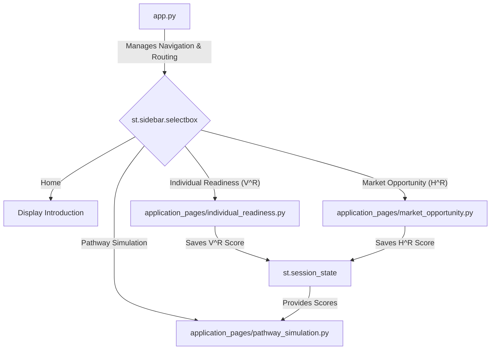

id: 68f65df5833967484a12de6d_documentation
summary: AI-Readiness score - Claude-4.5 Documentation
feedback link: https://docs.google.com/forms/d/e/1FAIpQLSfWkOK-in_bMMoHSZfcIvAeO58PAH9wrDqcxnJABHaxiDqhSA/viewform?usp=sf_link
environments: Web
status: Published
# Building an AI Career Navigator with Streamlit

## Introduction to the AI Career Navigator
Duration: 05:00

Welcome to the AI Career Navigator & Pathway Planner Codelab! In today's rapidly evolving technological landscape, understanding one's preparedness for a career in Artificial Intelligence is more crucial than ever. This application provides a structured, quantitative framework called the **AI-Readiness Score (AI-R)** to help individuals assess their standing and plan their career development.

The AI-R framework is a parametric model designed to quantify an individual's preparedness for AI-enabled careers. It holistically evaluates both personal skills and external market factors to provide a comprehensive readiness score.

<aside class="positive">
<b>What you'll learn:</b>
<ul>
    <li>The core concepts behind the AI-Readiness Score ($V^R, H^R$, Synergy).</li>
    <li>How to structure a multi-page Streamlit application for clarity and scalability.</li>
    <li>How to use interactive widgets like sliders and selectboxes to create a dynamic user experience.</li>
    <li>How to use Plotly to create insightful visualizations like radar charts, bar charts, and gauges.</li>
    <li>How to use Streamlit's Session State to pass information between pages.</li>
</ul>
</aside>

### The AI-Readiness Score (AI-R) Framework

The application is built around a central formula that combines three key pillars:

1.  **Idiosyncratic Readiness ($V^R$)**: This represents your personal capabilities, skills, and adaptability. It's what *you* bring to the table.
2.  **Systematic Opportunity ($H^R$)**: This represents the external market conditions for a specific role. It's the opportunity the *market* provides.
3.  **Synergy**: This measures the alignment between your skills and the market's needs. High synergy means you have the right skills for the in-demand jobs.

The formula is expressed as:

$$AI-R_{i,t} = \alpha \cdot V^R_i(t) + (1-\alpha) \cdot H^R_i(t) + \beta \cdot \text{Synergy}\%(V^R, H^R)$$

### Application Architecture

The application is designed with a modular approach. A central `app.py` file acts as the main router, while the logic and UI for each section are encapsulated in their own Python files within an `application_pages` directory. This makes the code easier to manage and maintain.

Here is a high-level overview of the application's architecture:



Let's dive into the code and see how this is implemented.

## Application Structure and Navigation
Duration: 05:00

The foundation of our application is the `app.py` script. It handles the initial setup, introduces the core concepts on the home page, and, most importantly, manages the navigation between the different modules of the application.

### The Main Script: `app.py`

This script uses the `streamlit` library to render the web interface. It sets the page configuration, displays a sidebar with a logo, and provides the main title. The core of its functionality is routing the user to different pages based on their selection in the sidebar.

```python
import streamlit as st
import pandas as pd
import numpy as np
import plotly.graph_objects as go
import plotly.express as px

#  Page Setup 
st.set_page_config(page_title="QuLab - AI Career Navigator", layout="wide")
st.sidebar.image("https://www.quantuniversity.com/assets/img/logo5.jpg")
st.sidebar.divider()

st.title("QuLab - AI Career Navigator & Pathway Planner")
st.divider()

#  Home Page Content (Introduction) 
st.markdown("""
In this lab, you will explore the **AI-Readiness Score (AI-R)** framework...
""")

#  Navigation Logic 
page = st.sidebar.selectbox(
    label="📊 Navigation",
    options=["Home", "Individual Readiness (V^R)", "Market Opportunity (H^R)", "Pathway Simulation"]
)

if page == "Home":
    st.info("👈 Use the sidebar to navigate to different sections of the application")
    st.subheader("📚 Getting Started")
    # ... more markdown

elif page == "Individual Readiness (V^R)":
    from application_pages.individual_readiness import run_individual_readiness
    run_individual_readiness()

elif page == "Market Opportunity (H^R)":
    from application_pages.market_opportunity import run_market_opportunity
    run_market_opportunity()

elif page == "Pathway Simulation":
    from application_pages.pathway_simulation import run_pathway_simulation
    run_pathway_simulation()
```

### Key Takeaways

*   **Modular Design**: The `if/elif` block demonstrates a simple yet effective way to create a multi-page application. Instead of cluttering `app.py` with all the logic, we import and call a specific function for each page (e.g., `run_individual_readiness()`).
*   **User-Friendly Navigation**: Using `st.sidebar.selectbox` creates a clean and intuitive navigation menu, keeping the main content area uncluttered.

<aside class="positive">
This modular structure is a best practice for building complex Streamlit applications. It improves code readability, maintainability, and allows different developers to work on different pages simultaneously.
</aside>

## Calculating Your Individual Readiness (V^R)
Duration: 10:00

The first step in calculating your AI-Readiness Score is to quantify your personal skills and attributes. This is handled by the **Individual Readiness ($V^R$)** page, powered by `application_pages/individual_readiness.py`. This module allows users to self-assess their capabilities across three core pillars.

### The Three Pillars of $V^R$

1.  **AI-Fluency**: Your technical skills and understanding of AI concepts.
2.  **Domain-Expertise**: Your knowledge and experience in a specific field.
3.  **Adaptive-Capacity**: Your soft skills, like flexibility and learning agility.

The UI uses `st.slider` widgets to capture user input for sub-components within each pillar. It also allows users to assign weights to each of the three pillars, acknowledging that their relative importance can vary.

### Code Implementation (`individual_readiness.py`)

The function `run_individual_readiness()` orchestrates the display of sliders, calculation of scores, and visualization.

```python
import streamlit as st
import pandas as pd
import plotly.graph_objects as go

def run_individual_readiness():
    st.header("Step 1: Assess Your Individual Readiness ($V^R$)")
    st.markdown("Rate your capabilities on a scale of 0 to 100.")

    #  Input Section 
    col1, col2 = st.columns([1, 1])
    with col1:
        st.subheader("Component Scores")
        # ... Sliders for AI-Fluency, Domain-Expertise, Adaptive-Capacity ...
        ai_fluency_score = st.slider("AI-Fluency", 0, 100, 50)
        domain_expertise_score = st.slider("Domain-Expertise", 0, 100, 60)
        adaptive_capacity_score = st.slider("Adaptive-Capacity", 0, 100, 70)
    
    with col2:
        st.subheader("Component Weights")
        # ... Sliders for weights ...
        w_ai = st.slider("Weight for AI-Fluency", 0.0, 1.0, 0.4, 0.05)
        w_domain = st.slider("Weight for Domain-Expertise", 0.0, 1.0, 0.4, 0.05)
        w_adaptive = st.slider("Weight for Adaptive-Capacity", 0.0, 1.0, 0.2, 0.05)

    #  Calculation 
    total_weight = w_ai + w_domain + w_adaptive
    if total_weight != 1.0:
        st.warning(f"Weights must sum to 1.0. Current sum is {total_weight:.2f}")

    vr_score = (ai_fluency_score * w_ai) + \
               (domain_expertise_score * w_domain) + \
               (adaptive_capacity_score * w_adaptive)
    
    st.session_state['vr_score'] = vr_score
    st.session_state['vr_components'] = {
        'AI-Fluency': ai_fluency_score,
        'Domain-Expertise': domain_expertise_score,
        'Adaptive-Capacity': adaptive_capacity_score
    }

    #  Display and Visualization 
    st.subheader("Your Calculated $V^R$ Score")
    st.metric(label="Idiosyncratic Readiness Score", value=f"{vr_score:.2f}")

    # Plotly Radar Chart
    categories = ['AI-Fluency', 'Domain-Expertise', 'Adaptive-Capacity']
    values = [ai_fluency_score, domain_expertise_score, adaptive_capacity_score]
    
    fig = go.Figure()
    fig.add_trace(go.Scatterpolar(
          r=values,
          theta=categories,
          fill='toself',
          name='Your Profile'
    ))
    st.plotly_chart(fig, use_container_width=True)
```

### Using Session State

A crucial line in the code is `st.session_state['vr_score'] = vr_score`. Streamlit's `session_state` is a dictionary-like object that persists across page re-runs and navigation. By storing the calculated $V^R$ score here, we make it accessible to the "Pathway Simulation" page later on.

The radar chart, created using `plotly.graph_objects.Scatterpolar`, provides an excellent visual summary of the user's strengths and weaknesses.

## Assessing Market Opportunity ($H^R$)
Duration: 08:00

After evaluating your personal skills, the next step is to analyze the market landscape for your target career. The **Market Opportunity ($H^R$)** page, driven by `application_pages/market_opportunity.py`, facilitates this analysis.

### The Four Pillars of $H^R$

This score is determined by four external factors related to a specific occupation:

1.  **AI-Enhancement Potential**: How much AI is expected to augment or transform this role.
2.  **Job Growth Projection**: The forecasted demand for this occupation.
3.  **Wage Premium**: The potential for higher earnings in this role due to AI skills.
4.  **Entry Accessibility**: The barriers to entry, such as required education or experience.

### Code Implementation (`market_opportunity.py`)

This module typically starts with a `st.selectbox` for the user to choose a target occupation. The data for each occupation is often stored in a dictionary or a Pandas DataFrame.

```python
import streamlit as st
import pandas as pd
import plotly.express as px

# Sample data for different occupations
JOB_DATA = {
    "Data Scientist": {"AI-Enhancement": 90, "Job Growth": 85, "Wage Premium": 80, "Entry Accessibility": 60},
    "AI Engineer": {"AI-Enhancement": 95, "Job Growth": 90, "Wage Premium": 90, "Entry Accessibility": 50},
    "Project Manager": {"AI-Enhancement": 70, "Job Growth": 65, "Wage Premium": 60, "Entry Accessibility": 80},
}

def run_market_opportunity():
    st.header("Step 2: Analyze the Market Opportunity ($H^R$)")

    #  Input Section 
    job_choice = st.selectbox("Select a Target Occupation", options=list(JOB_DATA.keys()))
    st.session_state['job'] = job_choice
    
    job_scores = JOB_DATA[job_choice]
    df = pd.DataFrame(list(job_scores.items()), columns=['Factor', 'Score'])

    #  Calculation 
    # In this simplified version, we'll use a simple average. 
    # A weighted average could also be implemented.
    hr_score = df['Score'].mean()
    st.session_state['hr_score'] = hr_score

    #  Display and Visualization 
    col1, col2 = st.columns(2)
    with col1:
        st.subheader(f"Market Factors for {job_choice}")
        st.dataframe(df, use_container_width=True)

    with col2:
        st.subheader("Calculated $H^R$ Score")
        st.metric(label="Systematic Opportunity Score", value=f"{hr_score:.2f}")

    # Plotly Bar Chart
    fig = px.bar(df, x='Factor', y='Score', title=f"Market Opportunity for a {job_choice}",
                 color='Factor', template='plotly_white')
    st.plotly_chart(fig, use_container_width=True)
```

Just like with the $V^R$ score, we store the calculated $H^R$ score in `st.session_state` using `st.session_state['hr_score'] = hr_score`. This makes it available for the final calculation on the simulation page. The use of a Plotly Express bar chart provides a quick, comparative view of the different market factors.

## Pathway Simulation and the Final AI-R Score
Duration: 15:00

This is where everything comes together. The **Pathway Simulation** page (`application_pages/pathway_simulation.py`) is the application's capstone. It retrieves the $V^R$ and $H^R$ scores from the session state, allows the user to fine-tune the model's parameters, and calculates the final AI-Readiness Score. Most importantly, it enables "what-if" analysis by simulating the impact of undertaking a learning pathway.

### The Simulation Flow

The process on this page follows a clear logical sequence:

1.  **Retrieve Scores**: Fetch $V^R$ and $H^R$ from `st.session_state`.
2.  **Set Parameters**: Allow user to set the weights $\alpha$ (Individual vs. Market) and $\beta$ (Synergy).
3.  **Calculate Synergy**: Compute the synergy score based on the alignment of $V^R$ and $H^R$.
4.  **Calculate Initial AI-R**: Compute the baseline AI-Readiness Score.
5.  **Select a Pathway**: The user chooses a learning activity (e.g., "Complete a Machine Learning Course").
6.  **Apply Impact**: The selected pathway applies a predefined boost to relevant components of the user's $V^R$ score.
7.  **Calculate Projected AI-R**: Re-calculate the $V^R$ and AI-R scores with the improvements.
8.  **Display Comparison**: Show the "Current" vs. "Projected" scores side-by-side.

```mermaid
flowchart TD
    A[Get V^R & H^R from Session State] --> B{Set α & β Sliders};
    B --> C[Calculate Initial Synergy & AI-R Score];
    C --> D{Select a Learning Pathway};
    D --> E[Define Score Improvements (Deltas)];
    E --> F[Calculate New V^R_projected];
    F --> G[Calculate New AI-R_projected];
    G --> H[Display 'Current' vs 'Projected' Scores];
```

### Code Implementation (`pathway_simulation.py`)

This module is the most complex, integrating all previous components.

```python
import streamlit as st
import plotly.graph_objects as go

#  Define Learning Pathways 
PATHWAYS = {
    "None": {},
    "Complete ML Course": {"AI-Fluency": +15},
    "Gain Project Experience": {"Domain-Expertise": +20},
    "Leadership Training": {"Adaptive-Capacity": +10}
}

def calculate_air_score(vr, hr, alpha, beta):
    # Simplified synergy calculation
    synergy = 100 - abs(vr - hr)
    air_score = (alpha * vr) + ((1 - alpha) * hr) + (beta * synergy)
    # Normalize to a 0-1000 scale for impact
    return min(max(air_score, 0), 100) * 10

def run_pathway_simulation():
    st.header("Step 3: Simulate Pathways & Calculate Your AI-R Score")

    if 'vr_score' not in st.session_state or 'hr_score' not in st.session_state:
        st.error("Please calculate your V^R and H^R scores on the respective pages first.")
        return

    #  Retrieve Scores 
    vr_initial = st.session_state['vr_score']
    hr_initial = st.session_state['hr_score']
    vr_components = st.session_state['vr_components']

    #  Parameter Inputs 
    col1, col2 = st.columns(2)
    with col1:
        alpha = st.slider("Alpha (α): Weight on Individual Readiness", 0.0, 1.0, 0.5, 0.05)
    with col2:
        beta = st.slider("Beta (β): Synergy Coefficient", 0.0, 1.0, 0.2, 0.05)
    
    #  Pathway Selection 
    pathway_choice = st.selectbox("Select a Learning Pathway to Simulate", options=list(PATHWAYS.keys()))
    
    #  Calculation 
    # Initial Score
    air_initial = calculate_air_score(vr_initial, hr_initial, alpha, beta)
    
    # Projected Score
    improvements = PATHWAYS[pathway_choice]
    vr_projected_components = vr_components.copy()
    for key, value in improvements.items():
        vr_projected_components[key] = min(100, vr_projected_components[key] + value)
    
    # Recalculate V^R (assuming equal weights for simplicity here)
    vr_projected = sum(vr_projected_components.values()) / len(vr_projected_components)
    air_projected = calculate_air_score(vr_projected, hr_initial, alpha, beta)
    
    #  Display Results 
    st.subheader("AI-Readiness Score Comparison")
    col1, col2 = st.columns(2)
    with col1:
        st.metric("Current AI-R Score", f"{air_initial:.0f}", f"{air_initial - air_projected:.0f}")
        # Gauge Chart for Current Score
        
    with col2:
        st.metric("Projected AI-R Score (after pathway)", f"{air_projected:.0f}", f"{air_projected - air_initial:+.0f}")
        # Gauge Chart for Projected Score
```

<aside class="negative">
<b>Model Limitations:</b> The synergy calculation and pathway impacts in this example are simplified for educational purposes. A production-level application would require a more sophisticated model, possibly trained on real-world career data, to accurately calculate synergy and the effects of specific certifications or experiences.
</aside>

This final page powerfully demonstrates the utility of the AI-R framework, transforming it from a static assessment tool into a dynamic career planning assistant.

## Conclusion
Duration: 02:00

Congratulations! You have successfully walked through the creation and functionality of the **QuLab AI Career Navigator**, a powerful tool built with Streamlit.

### Recap

In this codelab, we explored:

*   The **AI-Readiness (AI-R) framework**, a structured model for quantifying career preparedness in the age of AI.
*   The three core components: **Idiosyncratic Readiness ($V^R$)**, **Systematic Opportunity ($H^R$)**, and the **Synergy** between them.
*   A **modular, multi-page Streamlit application structure** that promotes clean and maintainable code.
*   The use of interactive widgets and **Plotly** visualizations to create an engaging and informative user experience.
*   The critical role of **`st.session_state`** for managing data flow between different pages of the application.
*   How to implement a "what-if" **pathway simulation** to provide actionable career guidance.

### Next Steps

This application serves as an excellent foundation that can be extended in many ways:

*   **Connect to Live Data**: Integrate with job market APIs (like LinkedIn or Glassdoor) to pull real-time data for the $H^R$ component.
*   **Refine the Model**: Enhance the synergy calculation and pathway impact models with more granular data or machine learning techniques.
*   **User Authentication**: Add user accounts to allow individuals to save their profiles and track their progress over time.
*   **Personalized Recommendations**: Develop a recommendation engine to suggest the most impactful learning pathways based on a user's profile and career goals.

We encourage you to experiment with the code, customize the parameters, and adapt the framework to your own career planning needs.
